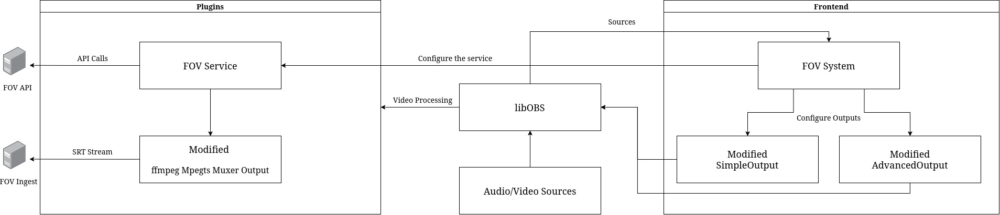

# FOV Software Architecture

## High-Level Architecture Overview

Traditional OBS Studio collapses all active layers, captures, and audio inputs down into a single flattened canvas and one composite audio master track. The FOV variant alters this behavior by maintaining complete structural isolation of visual and auditory inputs from capture all the way to presentation in the Web GUI.

* **Video Capture Track Isolation:** Every distinct active video source inside the current OBS scene is dynamically allocated its own private frame view context and an isolated hardware encoder instance.
* **Audio Source Tracking (1:1 Isolation):** Unlike standard OBS which mixes multiple inputs together onto shared master tracks, `FOVSystem` intercepts audio at the source layer. Each active audio source is automatically hijacked and assigned its own exclusive `mixer_id` track mask. This prevents audio bleed and locks out human error by disabling custom user mixer modifications in the OBS UI.
* **Unified Container Transport:** All parallel encoded video and audio streams are packaged sequentially into a singular MPEG-TS (MPEG Transport Stream) before being pushed over the network.

## Technical Pipeline Breakdown

### Video Architecture
When a video source transitions to an active state, `FOVSystem` provisions a dedicated `VideoTrack` node:
1.  **View Context Allocation:** An internal `obs_view_t` is mapped to the source, ensuring raw frame allocation occurs independently of the primary OBS program canvas.
2.  **Resolution Alignment:** Frame dimensions are processed through an aspect alignment macro: `OUT_ALIGN(dimension, 16)`. This guarantees compatibility with rigorous hardware macroblock requirements.
3.  **Muxer Binding:** Encoders are appended to an `obs_encoder_group_t` tracking node and indexed continuously using `obs_output_set_video_encoder2`.

### Audio Architecture
To ensure zero configuration effort and bulletproof stream isolation, audio tracks bypass global mixer matrices entirely:
1.  **Automated Mixer Hijacking:** When an audio source is registered, `FOVSystem` overrides its bitmask using `obs_source_set_audio_mixers(source, 1 << mixer_id)`. This forces the source onto a single exclusive pipeline and clears it from all other tracks.
2.  **Hardware UI Enforcement:** By programmatically assigning and managing these bits at runtime, the platform ignores any changes made in the OBS "Advanced Audio Properties" layout, preserving track isolation.
3.  **Index Sequencing:** Within the MPEG-TS multiplexer loop, audio track indexing begins exactly where video track array iteration terminates, ensuring flawless track allocation inside the transport stream:

$$\text{Transport Stream Track ID} = \text{Video Track Count} + \text{Source Track Index}$$

