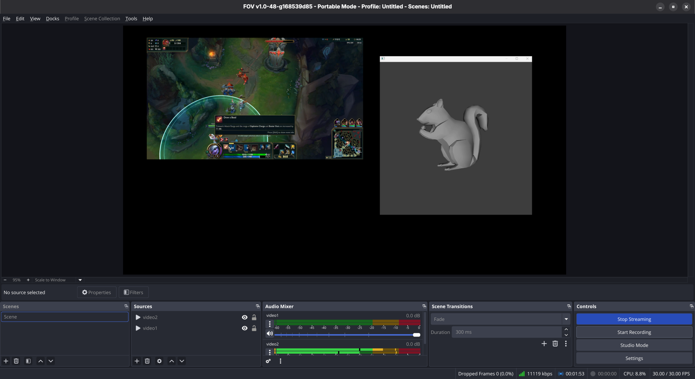
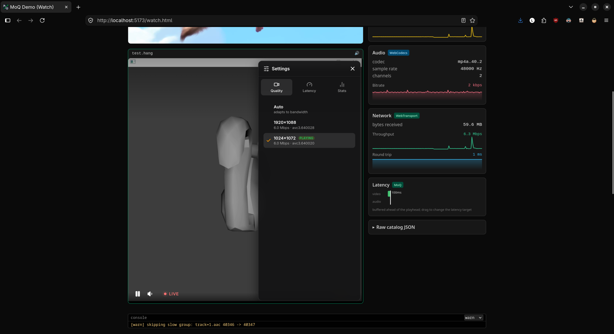
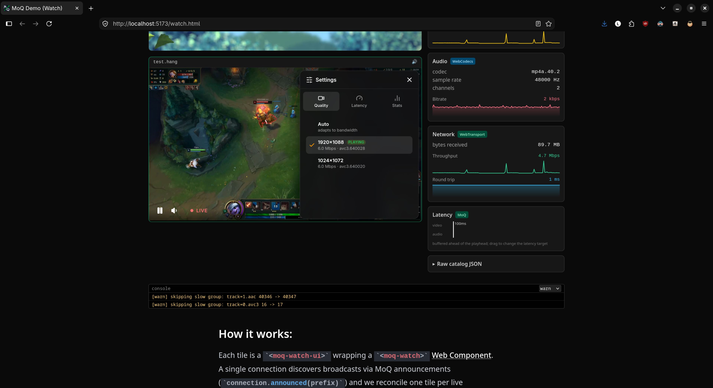
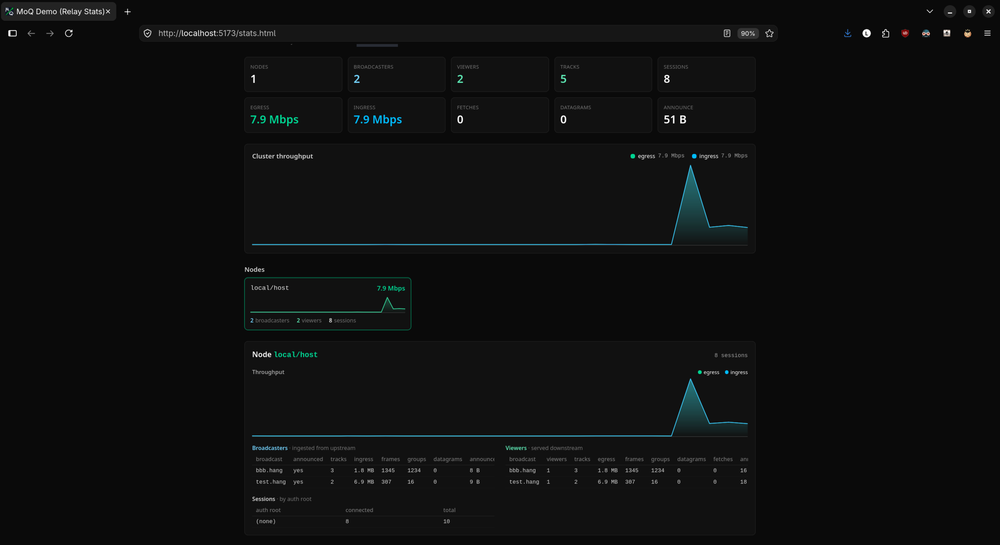

# Prototyping: Media Over QUIC (MOQ) Integration and Architectural Analysis

> Date: September 22, 2026

## Introduction

This document details the Media Over QUIC (MOQ) Proof of Concept (POC) integration attempt within the FOV (Flexible Output View) OBS Studio fork, explains why its active development was paused, and outlines the underlying architectural considerations.

The MOQ integration was implemented as an independent plugin module located under `/plugins/flexible-output-view/moq/` on the dedicated [branch poc-media-over-quic](https://github.com/Flexible-Output-View/obs-studio-fov/tree/poc-media-over-quic), as well as a small patch to `web-fov`, also on a dedicated [branch poc-media-over-quic](https://github.com/Flexible-Output-View/web-fov/tree/poc-media-over-quic).

---

## 1. Protocol Overview

### What is MOQ?
Media Over QUIC (MOQ) is an emerging protocol family (such as MOQT - Media over QUIC Transport) designed specifically for low-latency live streaming. It leverages the QUIC transport layer—combining TCP-like reliability with UDP speed—and utilizes QUIC streams and datagrams (frequently via WebTransport) to deliver adaptive bitrate video streams with mandatory TLS 1.3 encryption.

### Technical Characteristics
* **Transport Protocol:** QUIC (UDP-based)
* **Wire Format:** QUIC streams and datagrams (often via WebTransport)
* **Security:** Mandatory TLS 1.3 encryption (inherent to QUIC)
* **Latency Target:** Sub-second latency with adaptive bitrate capabilities
* **Platform Support:** Cross-platform via IETF standards and C/C++ SDKs

## 2. Comparison: MOQ vs. Current SRT/HLS Approach

| Feature | SRT / HLS (Current) | MOQ (POC - Paused) |
| :--- | :--- | :--- |
| **Transport Layer** | TCP/UDP (SRT) & TCP (HLS) | QUIC (UDP via streams/datagrams) |
| **Security** | Optional TLS / Standard HTTP | Mandatory TLS 1.3 |
| **Viewer Latency** | ~2–5 seconds | <1 second (theoretical) |
| **Browser Compatibility** | Native (HLS via HTML5 video) | Limited (requires WebTransport/WebCodecs support) |
| **Ecosystem Maturity** | Production-ready industry standard | Emerging / Experimental |

Since MOQ operates on a publisher/subscriber model, it can also help reduce bandwidth requirements for users who do not wish to view all video and audio tracks simultaneously.

## 3. POC Implementation Details & Setup

The core experiment consisted of integrating an existing official MOQ OBS output plugin into our modified architecture to ensure compatibility with our multi-track system.

Because the official MOQ library implementation is written in Rust, we had to add a compilation workflow for it inside our `obs-studio-fov` repository; we ended up [forking the official MOQ repository](https://github.com/Flexible-Output-View/moq) to implement a fix tailored to our project requirements.

We decided to implement a variant of our main SRT service called `fov-service-moq` to allow for interoperability during a transition period if we ever migrate to MOQ.

* **Service Registration:** The MOQ service provider was registered alongside the existing SRT service (`fov_service_srt`) under the unique service ID `fov_service_moq`, linking to the customized `fov_moq_output` module.
* **Multi-Track Preservation:** The POC successfully preserved the multi-track management architecture (`FOVSystem`), allowing multiple isolated video and audio tracks to be managed.

### Running the POC
To run the POC, ensure you have Rust and Cargo installed, then follow these steps:
1. Clone our forked [MOQ repository](https://github.com/Flexible-Output-View/moq) and run the command `just` at the root to launch the entire MOQ demo stack.
2. Clone the [web-fov](https://github.com/Flexible-Output-View/web-fov) repository and switch to the `poc-media-over-quic` branch. It contains a debug route that instructs OBS to stream to the relay at `http://localhost:4443`.
3. Deploy `web-fov` locally using `docker compose up --build`. *(Note: We do not use the FOV frontend in this POC since MoQ is not yet integrated into the web stack; instead, we use the official MOQ demo frontend.)*
4. Compile the `poc-media-over-quic` branch of [obs-studio-fov](https://github.com/Flexible-Output-View/obs-studio-fov) with `ENABLE_FOV_DEBUG_INGEST` set to **ON** in the root `CMakeLists.txt`.
5. Select the service **FOV - Multitrack [MoQ]** in the OBS settings.
6. Set the URL to the locally deployed FOV backend (`http://localhost:4000`) and the stream key to `test.hang` (the `.hang` suffix is mandatory for correct routing).
7. Start the stream; it will appear at [http://localhost:5173/watch.html](http://localhost:5173/watch.html) alongside the MOQ demo stream.

*OBS FOV streaming using MOQ*

*The first video track can be played in the MOQ frontend*

*The second video track can be played in the MOQ frontend*

*We can also confirm that multiple tracks are sent in the test.hang stream*

## 4. Architectural Analysis: Why the MOQ Integration Was Paused

Despite successful compilation and a functional prototype operating with the official MOQ-relay and test frontend, active development on the integration was paused due to several critical architectural roadblocks.

### Backend Server Architecture Incompatibility
The current FOV video distribution pipeline relies on a proven SRT/HLS workflow:

`OBS` -> `MPEG-TS/SRT` -> `Backend Ingest` -> `FFmpeg` -> `TS Segments` -> `HLS Distribution` -> `Frontend`

In contrast, a full MOQ pipeline would require:

`OBS` -> `MOQ` -> `Backend Ingest` -> `MOQ Relay` -> `Frontend`

While simpler in theory, migrating to MOQ introduces significant infrastructure hurdles.
It requires a complete rewrite of our web video player to support simultaneous video and audio tracks via MoQ, alongside major updates to our backend ingestion infrastructure.

Furthermore, browser support for bleeding-edge WebTransport, WebCodecs, and WebAudio APIs varies across platforms and environments.

### Cost-Benefit Assessment
* **Benefits:** Modern congestion control, native TLS 1.3, potential sub-second latency, and native stream multiplexing.
* **Drawbacks:** Demands a total backend rewrite, lacks mature production-grade deployment infrastructure at scale, and requires an engineering investment that outweighs current MVP requirements. The existing SRT + HLS stack already meets all target performance metrics.

## 5. Future Implications and Next Steps

### Current Status of the Experiment
Nothing has been removed from the repository. The working prototype and experimental code remain safely isolated on the **`poc-media-over-quic`** branch.

Development was paused because, while the proof of concept successfully validates that multi-track streaming over MOQ is feasible on the OBS side, the sweeping backend and frontend architecture changes required for production are outside the immediate scope of the current project roadmap.

## Consulted Resources
- [Media over QUIC](https://moq.dev/)
- [MoQ: Refactoring the Internet's real-time media stack](https://blog.cloudflare.com/moq/)
- [IETF Media Over QUIC (moq)](https://datatracker.ietf.org/group/moq/about/)
- [Replacing WebRTC with Media over QUIC - Luke Curley](https://www.youtube.com/watch?v=l5tvrUOF2Ws)
- [https://github.com/moq-dev/moq](https://github.com/moq-dev/moq)
