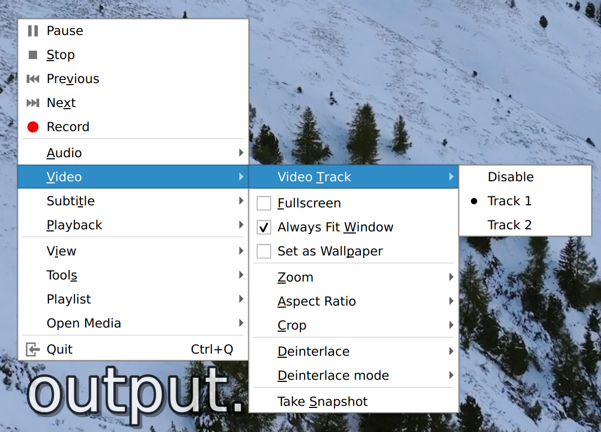
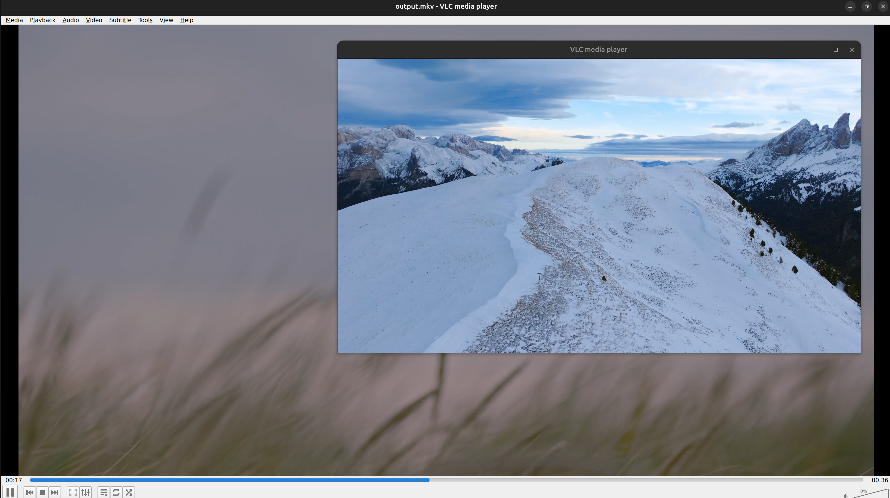
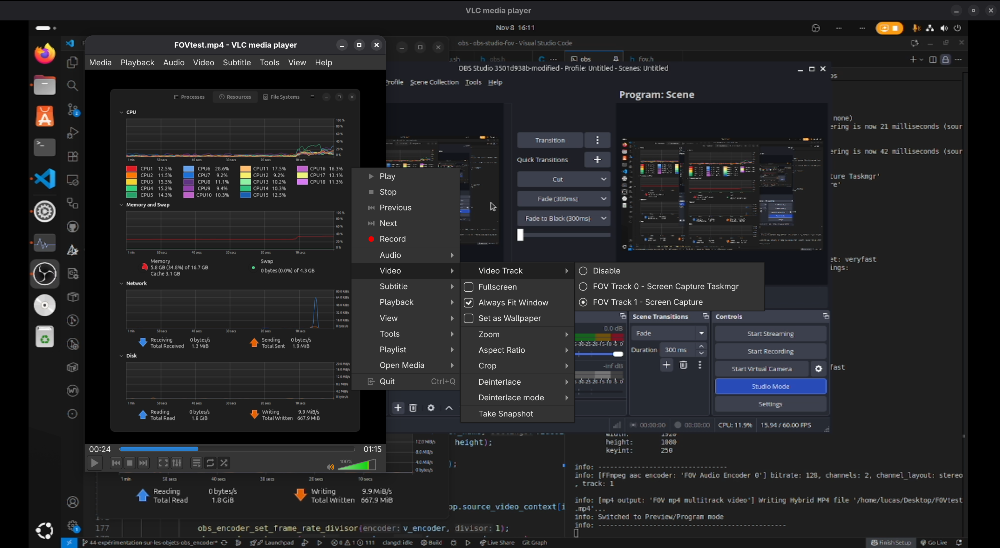

# Research: Support and Particularities of Multi-Track Video

> Date: October 29th, 2025

## Introduction
As part of our project, we want to send all video streams from the sources shared by the streamer to our platform.

We will detail our approach in this document to choose how the streams will be sent from the streaming software to our platform.

## Initial Experiments
### Sending Separate Video Streams
At the beginning of our project, we built a prototype allowing us to display multiple sources coming from OBS (the streaming software) to our platform.

We implemented this feature using a Node.js server and an Nginx server to receive multiple HLS streams from OBS.

These streams received by the web backend were temporarily stored by Nginx and retransmitted to connected clients.

## Experiment on a Local Multi-Track File with FFmpeg and VLC
FFmpeg allows creating (muxing) video files in the MKV format that can contain multiple video tracks (much like having multiple audio tracks), using the command:

    ffmpeg -i flux1.mp4 -i flux2.mp4 -map 0:v -map 1:v -c copy output.mkv

It is then possible to play the video and select which video track you want to display.

For example with VLC:

It is also possible to display both tracks simultaneously and synchronously with VLC using the command:

    vlc --sout-all --sout '#display' output.mkv

VLC automatically opens a second rendering window when playing the video, the play/pause and scrubbing controls work perfectly and in a synchronized manner:

This last feature is interesting because in our case it will be necessary to render multiple video tracks simultaneously and synchronously.
VLC being open-source software, some design elements of the player will likely be useful for our project.

## Experimentation and Implementation in OBS
In 2024, the OBS project implemented an "Hybrid MP4" feature to leverage Twitch's enhanced broadcasting, which aims to let the streamer produce multiple streams of different qualities so that viewers can benefit from multiple stream qualities.

The implementation made by OBS consists of sending an RTMP stream with an MP4 container containing multiple video tracks.

This feature closely aligns with our goal, allowing us to understand how multi-track videos can be created using the internal OBS API.

An experiment allowed us to understand the necessary operations in more detail, consisting of 10 main steps:
1. Create an output `obs_output_t`
2. Create an encoder group `obs_encoder_group_t` to manage multiple encoders synchronously
3. Create a view `obs_view_t` for each video track
4. Configure the view with options such as framerate, dimensions, and color space
5. Assign a video source (or the default global video output in the case of enhanced broadcasting) to each view.
6. Get a video object and add the view to the rendering pipeline with `obs_view_add2`
7. For each view, create a dedicated encoder, configure it, and assign the view's video object as input, resolving potential source resizing issues.
8. Add the encoder to the output, using the `obs_output_set_video_encoder2` function and an index corresponding to the video track into which the data should be muxed.
9. Add at least one audio encoder
10. Initialize the encoders and start the output

Thanks to these steps, we can create a small program that will record each video source in a separate track. The results are conclusive, and the resulting video does indeed contain two video tracks, which can be played simultaneously with VLC:

On the left, a source that records only the Task Manager application, and on the right, a source that records the entire screen.

A video player such as VLC is required to switch between tracks or launch them simultaneously.

However, this experiment raises potential issues: performance is reduced due to the simultaneous use of multiple encoders. This is not necessarily a major issue if the encoder used is hardware-accelerated (for example with Nvidia NVENC, Intel QuickSync, or AMD AMF) but it remains a problem in the case of CPU encoders.

Furthermore, the number of video players capable of switching or viewing multiple video tracks remains a minority.

## Technical Choice and Comparison of Transport Technologies
The choice of the streaming protocol to use (RTMP, HLS, MPEG Dash, WebRTC, SRT, custom, etc.) is detailed in the document [Video Transport Protocols](../video%20transport%20protocols/readme.md)

### Playback in a Browser
Since browsers do not natively support playing a stream containing multiple tracks simultaneously, it is necessary to implement conversion at the backend level and implement synchronization logic in the web player: [Multi track video player](../multi-track%20video%20player/researches.md)

## Consulted Resources
- [HLS, RTMP, DASH, WebRTC, and More: A Simple Guide to Streaming Protocols](https://medium.com/@n20/hls-rtmp-dash-webrtc-and-more-a-simple-guide-to-streaming-protocols-98cbabcd599f)
- [HLS, MPEG-DASH, RTMP, and WebRTC: Which Protocol is Right for Your App?](https://getstream.io/blog/protocol-comparison/)
- [OBS, Writing an MP4 Muxer for Fun and Profit](https://obsproject.com/blog/obs-studio-hybrid-mp4)
- [Enhanced Broadcasting with Multiple Encodes](https://help.twitch.tv/s/article/multiple-encodes?language=en_US)
