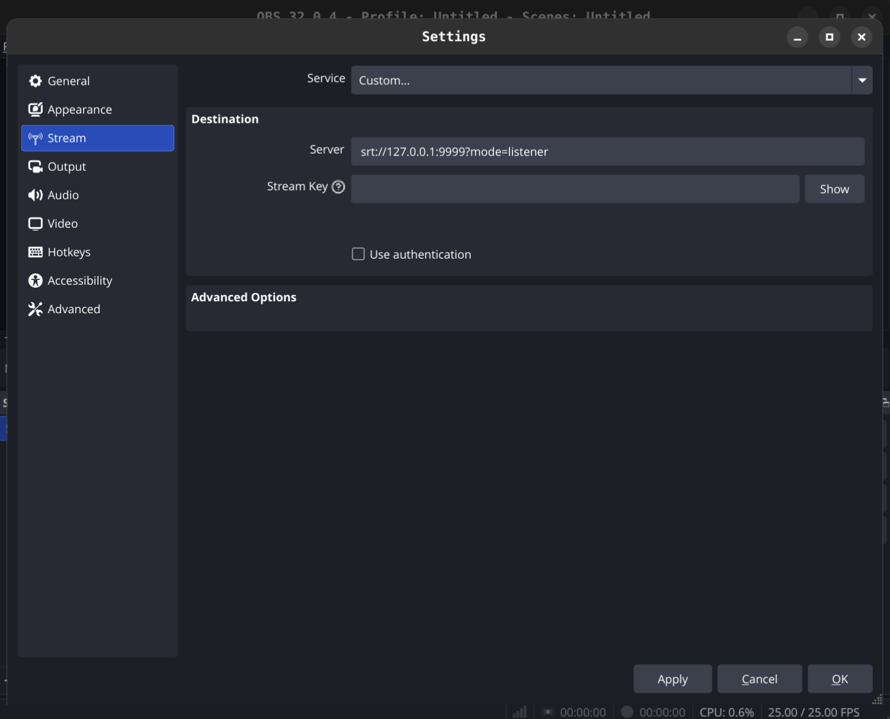
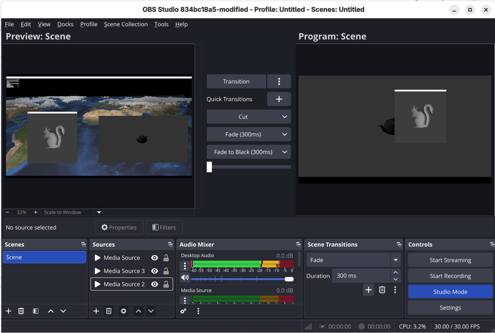
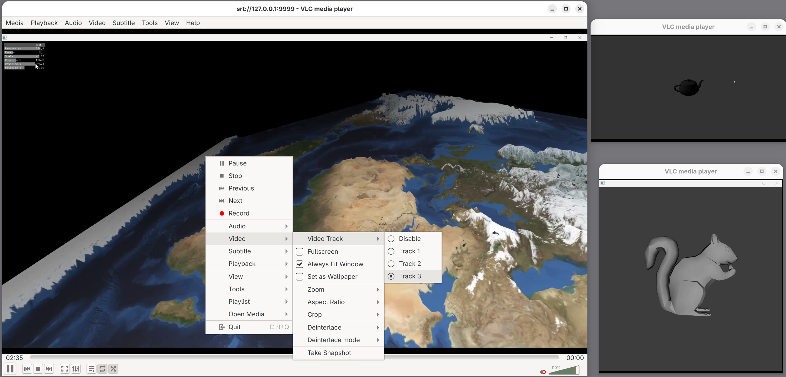

# Prototyping: Adding Multi-Track Support to the ffmpeg-ts Output of obs-ffmpeg

> Date: January 24th, 2026

## Introduction
To leverage the SRT protocol and support multi-track video, we need to use the MPEG-TS transport format.

OBS is natively capable of transmitting a stream containing **a single video track** over SRT using MPEG-TS.
To do this, you can enter an SRT URL such as `srt://127.0.0.1:9999?mode=listener` in a custom service within the OBS settings.



The stream can then be played back on the URL `srt://127.0.0.1:9999?mode=caller` with VLC, for example.

## Adding Multi-Track Support
For some time now, OBS has updated part of `libOBS` to support multiple simultaneous encoders and create synchronized groups. This feature was primarily dedicated to Twitch's "Enhanced broadcasting", allowing multiple resolutions to be sent to the service.

Several OBS "outputs" (code handling output to a protocol/service) were also updated on this occasion to add support for multiple video tracks (for example, the `mp4-output` output allowing a multi-track video to be recorded, although this is not exposed in the UI).

However, the output used for SRT (`ffmpeg_mpegts_muxer`) did not receive this treatment and only allows a single video stream.

We therefore duplicated this output to avoid breaking standard OBS functions, then modified it to add multi-track support.

The modification mainly consisted of converting configuration and context data structures to use arrays, modifying parameters passed to libAV, handling the reception of video packets from multiple encoders, and modifying certain auxiliary functions.

We did not need to modify the encoder objects themselves since this was already done by the OBS team a few years ago, massively simplifying the complexity.

## Results

Now that the modifications have been implemented, we can test OBS with 3 inputs that will be passed as output into our SRT stream, resulting in 3 video tracks.

Here, OBS streams 3 "media sources" with different resolutions to 3 tracks of the SRT stream.



To view the properties of the stream produced with ffmpeg, we use the `ffprobe` command.

```
➜  ~ ffprobe "srt://127.0.0.1:9999?mode=caller"
Input #0, mpegts, from 'srt://127.0.0.1:9999?mode=caller':
  Duration: N/A, start: 0.045333, bitrate: N/A
  Program 1
    Metadata:
      service_name    : FOV Multi-Stream
      service_provider: FOV Team
  Stream #0:0[0x100]: Video: h264 (High) ([27][0][0][0] / 0x001B), yuv420p(tv, bt709, progressive), 2880x1552 [SAR 1:1 DAR 180:97], 30 fps, 30 tbr, 90k tbn
  Stream #0:1[0x101]: Video: h264 (High) ([27][0][0][0] / 0x001B), yuv420p(tv, bt709, progressive), 1920x1024 [SAR 1:1 DAR 15:8], 30 fps, 30 tbr, 90k tbn
  Stream #0:2[0x102]: Video: h264 (High) ([27][0][0][0] / 0x001B), yuv420p(tv, bt709, progressive), 1024x1072 [SAR 1:1 DAR 64:67], 30 fps, 30 tbr, 90k tbn
  Stream #0:3[0x103]: Audio: aac (LC) ([15][0][0][0] / 0x000F), 48000 Hz, stereo, fltp, 130 kb/s
```

Using the TSDuck utility under Linux, it is possible to analyze the produced stream in more detail:

```
➜  ~ tsp -I srt --caller 127.0.0.1:9999 -P analyze -O drop

^C* tsp: user interrupt, terminating...

===============================================================================
|  TRANSPORT STREAM ANALYSIS REPORT                                           |
|=============================================================================|
|  Transport Stream Id: .......... 0x0001 (1)  |  Services: .............. 1  |
|  Bytes: ....................... 127,538,448  |  PID's: Total: .......... 7  |
|  TS packets: ...................... 678,396  |         Clear: .......... 7  |
|     With invalid sync: .................. 0  |         Scrambled: ...... 0  |
|     With transport error: ............... 0  |         With PCR's: ..... 1  |
|     Suspect and ignored: ................ 0  |         Unreferenced: ... 0  |
|-----------------------------------------------------------------------------|
|  Transport stream bitrate, based on ....... 188 bytes/pkt    204 bytes/pkt  |
|  User-specified: ......................... 19,155,697 b/s   20,785,969 b/s  |
|  Estimated based on PCR's: ............... 19,142,257 b/s   20,771,385 b/s  |
|  Selected reference bitrate: ............. 19,142,257 b/s   20,771,385 b/s  |
|-----------------------------------------------------------------------------|
|  Broadcast time: ................................... 53 sec (0 min 53 sec)  |
|-----------------------------------------------------------------------------|
|  Srv Id  Service Name                              Access          Bitrate  |
|  0x0001  FOV Multi-Stream ............................. C   19,002,273 b/s  |
|                                                                             |
|  Note 1: C=Clear, S=Scrambled                                               |
|  Note 2: Unless specified otherwise, bitrates are based on 188 bytes/pkt    |
===============================================================================


===============================================================================
|  SERVICES ANALYSIS REPORT                                                   |
|=============================================================================|
|  Global PID's                                                               |
|  TS packets: 4,961, PID's: 2 (clear: 2, scrambled: 0)                       |
|-----------------------------------------------------------------------------|
|     PID  Usage                                     Access          Bitrate  |
|   Total  Global PID's ................................. C      139,984 b/s  |
|   Subt.  Global PSI/SI PID's (0x00-0x1F) .............. C      139,984 b/s  |
|  0x0000  PAT .......................................... C      136,937 b/s  |
|  0x0011  SDT/BAT ...................................... C        3,047 b/s  |
|=============================================================================|
|  Service: 0x0001 (1), TS: 0x0001 (1), Original Netw: 0xFF01 (65281)         |
|  Service name: FOV Multi-Stream, provider: FOV Team                         |
|  Service type: 0x01 (Digital television service)                            |
|  TS packets: 673,435, PID's: 5 (clear: 5, scrambled: 0)                     |
|  PMT PID: 0x1000 (4096), PCR PID: 0x0100 (256)                              |
|-----------------------------------------------------------------------------|
|     PID  Usage                                     Access          Bitrate  |
|   Total  Digital television service ................... C   19,002,273 b/s  |
|  0x0100  AVC video (2880x1552, high profile, level 5.0  C    6,229,340 b/s  |
|  0x0101  AVC video (1920x1024, high profile, level 4.0  C    6,232,077 b/s  |
|  0x0102  AVC video (1024x1072, high profile, level 3.2  C    6,222,625 b/s  |
|  0x0103  MPEG-2 AAC Audio ............................. C      181,294 b/s  |
|  0x1000  PMT .......................................... C      136,937 b/s  |
|          (C=Clear, S=Scrambled, +=Shared)                                   |
===============================================================================


===============================================================================
|  PIDS ANALYSIS REPORT                                                       |
|=============================================================================|
|  PID: 0x0000 (0)                                                       PAT  |
|-----------------------------------------------------------------------------|
|  Global PID                Transport:                Discontinuities:       |
|  Bitrate: ... 136,937 b/s  Packets: ......... 4,853  Expected: ......... 0  |
|  Access: .......... Clear  Adapt.F.: ............ 0  Unexpect: ......... 0  |
|                            Duplicated: .......... 0  Sections:              |
|                                                      Unit start: ... 4,853  |
|=============================================================================|
|  PID: 0x0011 (17)                                                  SDT/BAT  |
|-----------------------------------------------------------------------------|
|  Global PID                Transport:                Discontinuities:       |
|  Bitrate: ..... 3,047 b/s  Packets: ........... 108  Expected: ......... 0  |
|  Access: .......... Clear  Adapt.F.: ............ 0  Unexpect: ......... 0  |
|                            Duplicated: .......... 0  Sections:              |
|                                                      Unit start: ..... 108  |
|=============================================================================|
|  PID: 0x0100 (256)                                               AVC video  |
|  PES stream id: 0xE0 (Video 0)                                              |
|  2880x1552, high profile, level 5.0, 4:2:0                                  |
|  Service: 0x0001 (1) FOV Multi-Stream                                       |
|-----------------------------------------------------------------------------|
|  Single Service PID        Transport:                Discontinuities:       |
|  Bitrate: . 6,229,340 b/s  Packets: ....... 220,766  Expected: ......... 0  |
|  Access: .......... Clear  Adapt.F.: ........ 2,154  Unexpect: ......... 0  |
|                            Duplicated: .......... 0  PES:                   |
|                            TSrate: . 19,142,257 b/s  Packets: ...... 1,618  |
|                                                      Inv.Start: ........ 0  |
|  Clock values range:                                                        |
|  PCR: ............... 545  PTS: ............. 1,618  DTS: .......... 1,329  |
|  from ................. 0  from ............. 6,000  from .............. 0  |
|  to ....... 1,455,300,000  to ........... 4,857,000  to ........ 4,851,000  |
|  Leaps: ............... 0  Leaps: ............... 0  Leaps: ............ 0  |
|=============================================================================|
|  PID: 0x0101 (257)                                               AVC video  |
|  PES stream id: 0xE0 (Video 0)                                              |
|  1920x1024, high profile, level 4.0, 4:2:0                                  |
|  Service: 0x0001 (1) FOV Multi-Stream                                       |
|-----------------------------------------------------------------------------|
|  Single Service PID        Transport:                Discontinuities:       |
|  Bitrate: . 6,232,077 b/s  Packets: ....... 220,863  Expected: ......... 0  |
|  Access: .......... Clear  Adapt.F.: ........ 1,625  Unexpect: ......... 0  |
|                            Duplicated: .......... 0  PES:                   |
|                                                      Packets: ...... 1,618  |
|                                                      Inv.Start: ........ 0  |
|  Clock values range:                                                        |
|                            PTS: ............. 1,618  DTS: .......... 1,220  |
|                            from ............. 6,000  from .............. 0  |
|                            to ........... 4,854,000  to ........ 4,851,000  |
|                            Leaps: ............... 0  Leaps: ............ 0  |
|=============================================================================|
|  PID: 0x0102 (258)                                               AVC video  |
|  PES stream id: 0xE0 (Video 0)                                              |
|  1024x1072, high profile, level 3.2, 4:2:0                                  |
|  Service: 0x0001 (1) FOV Multi-Stream                                       |
|-----------------------------------------------------------------------------|
|  Single Service PID        Transport:                Discontinuities:       |
|  Bitrate: . 6,222,625 b/s  Packets: ....... 220,528  Expected: ......... 0  |
|  Access: .......... Clear  Adapt.F.: ........ 1,616  Unexpect: ......... 0  |
|                            Duplicated: .......... 0  PES:                   |
|                                                      Packets: ...... 1,617  |
|                                                      Inv.Start: ........ 0  |
|  Clock values range:                                                        |
|                            PTS: ............. 1,617  DTS: .......... 1,224  |
|                            from ............. 6,000  from .............. 0  |
|                            to ........... 4,854,000  to ........ 4,848,000  |
|                            Leaps: ............... 0  Leaps: ............ 0  |
|=============================================================================|
|  PID: 0x0103 (259)                                        MPEG-2 AAC Audio  |
|  PES stream id: 0xC0 (Audio 0)                                              |
|  Service: 0x0001 (1) FOV Multi-Stream                                       |
|-----------------------------------------------------------------------------|
|  Single Service PID        Transport:                Discontinuities:       |
|  Bitrate: ... 181,294 b/s  Packets: ......... 6,425  Expected: ......... 0  |
|  Access: .......... Clear  Adapt.F.: ........ 5,008  Unexpect: ......... 0  |
|                            Duplicated: .......... 0  PES:                   |
|                                                      Packets: ...... 2,524  |
|                                                      Inv.Start: ........ 0  |
|  Clock values range:                                                        |
|                            PTS: ............. 2,524                         |
|                            from ............. 4,080                         |
|                            to ........... 4,848,240                         |
|                            Leaps: ............... 0                         |
|=============================================================================|
|  PID: 0x1000 (4096)                                                    PMT  |
|  Service: 0x0001 (1) FOV Multi-Stream                                       |
|-----------------------------------------------------------------------------|
|  Single Service PID        Transport:                Discontinuities:       |
|  Bitrate: ... 136,937 b/s  Packets: ......... 4,853  Expected: ......... 0  |
|  Access: .......... Clear  Adapt.F.: ............ 0  Unexpect: ......... 0  |
|                            Duplicated: .......... 0  Sections:              |
|                                                      Unit start: ... 4,853  |
===============================================================================


===============================================================================
|  TABLES & SECTIONS ANALYSIS REPORT                                          |
|=============================================================================|
|  PID: 0x0000 (0)                                                       PAT  |
|-----------------------------------------------------------------------------|
|  0x00 (0, PAT), TID ext: 0x0001 (1)                                         |
|      Repetition: ...... 11  ms  Section cnt: .... 4,853                     |
|      Min repet.: ....... 0  ms  Table cnt: ...... 4,853                     |
|      Max repet.: ..... 159  ms  Version: ............ 0                     |
|=============================================================================|
|  PID: 0x0011 (17)                                                  SDT/BAT  |
|-----------------------------------------------------------------------------|
|  0x42 (66, SDT Actual), TID ext: 0x0001 (1)                                 |
|      Repetition: ..... 494  ms  Section cnt: ...... 108                     |
|      Min repet.: ..... 372  ms  Table cnt: ........ 108                     |
|      Max repet.: ..... 618  ms  Version: ............ 0                     |
|=============================================================================|
|  PID: 0x1000 (4096)                                                    PMT  |
|  Service: 0x0001 (1) FOV Multi-Stream                                       |
|-----------------------------------------------------------------------------|
|  0x02 (2, PMT), TID ext: 0x0001 (1)                                         |
|      Repetition: ...... 11  ms  Section cnt: .... 4,853                     |
|      Min repet.: ....... 0  ms  Table cnt: ...... 4,853                     |
|      Max repet.: ..... 159  ms  Version: ............ 0                     |
===============================================================================
```

Here is the result when we open the SRT stream with VLC; the 3 video tracks are successfully transmitted and can be played back synchronously.

You must also ensure that the source video dimensions are aligned before attempting to encode, as H.264 has certain limitations in this regard.



This stream can then be directly received by our video pipeline backend for conversion and broadcasting to viewers.

## Consulted Resources
- [TSDuck](https://tsduck.io/)
- [Introduction to MPEG-TS](https://tsduck.io/docs/mpegts-introduction.pdf)
- [MPEG transport stream](https://en.wikipedia.org/wiki/MPEG_transport_stream)
- [OBS Source code & OBS FFmpeg wrapper](https://github.com/obsproject/obs-studio/tree/release/32.0/plugins/obs-ffmpeg)
- [MPEG-2: Understanding the Transport Stream Structure](https://medium.com/@amitdogra70512/mpeg-2-understanding-the-transport-stream-structure-dcf95b2b550b)
