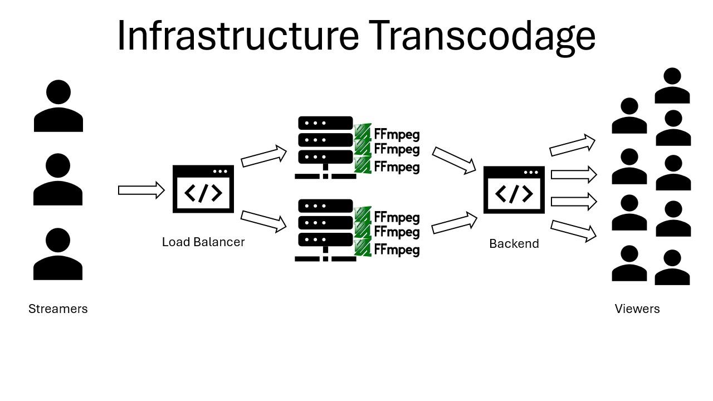

# Benchmark: Encoding, Transcoding, and Cost Analysis

> Date: June 23rd, 2025

## Introduction

**Transcoding** is a video processing method aimed at **reducing the bandwidth** required by a stream, thereby enabling support for slower network connections or generating **adaptive bitrates**.
The principle consists of **reducing the quality** (resolution, bitrate) of the source video stream by re-encoding it into a lower quality or with a different codec. However, this process is **resource-heavy** (computation and memory) and requires high-performance hardware.

As part of this benchmark, we seek to evaluate whether transcoding can be a viable solution to **optimize and reduce the bandwidth cost** potentially consumed by the project.

Here is the potential architecture of a solution using **FFmpeg** to transcode the video streams received by the platform before distributing them to users:

## Infrastructure Cost Evaluation

The **operational costs** of the solution will be directly correlated to the number of users and streams managed.

Estimation of minimal costs at OVH:
- **1 Database**: approximately €50/month.
- **1 Web Hosting Server** (with 2 Gbps bandwidth): approximately €60/month.
- **Minimum monthly cost (excluding transcoding)**: approximately **€110/month**.

### Evaluation of Maximum Bandwidth Capacity
Based on an **average video bitrate of 6 Mbps** for a **1080p60** stream, the total bandwidth required is given by the relation:

Average bandwidth = Number of streams × ((6 Mbps × average number of streams in a stream) × number of viewers)

With a server offering **2 Gbps**, the **maximum theoretical number of simultaneous streams** is:
Maximum number of streams = 2000 Mbps / (6 Mbps/stream) ≈ 333 simultaneous streams

Thus, for a very minimalist deployment of the solution, the project would require approximately **€110/month** to manage a **theoretical maximum of 333 streams**.

> [!NOTE]
> This relationship is not equivalent to 333 different streamers, as our project allows managing multiple streams per streamer.

## Transcoding Benchmark

### Test Environment

The test consists of evaluating the transcoding of a **1080p60 source stream at 6 Mbps (H.264 Codec)** to a **720p25** version.

- **Hardware Used**: MSI GF63 Thin 11SC Laptop (CPU: Intel Core i5-11400H - 6 cores/12 threads; GPU: Nvidia GTX 1650 Max-Q).
- **Software**: HandBrake (based on FFmpeg) on Windows.

**Test Results:**
| Resource | Encoder | Maximum Simultaneous Streams | Observations |
| :--- | :--- | :--- | :--- |
| **GPU** | NVENC H.264 | 5 streams | The **framerate** is maintained above the required minimum. |
| **CPU** | x264 | 3 streams | The **framerate** drops below the required minimum beyond 3 streams. |

> [!Note]
> The bottleneck appears to come from the CPU's computing power.
>
> Although the GPU (with NVENC encoder) allows more streams (limited to 8 on consumer cards), the increase in simultaneous transcoding tasks ends up overloading the CPU, causing the framerate to drop below the minimum required for live playback.

### Extrapolation to Project Requirements
To estimate costs at the project scale, we extrapolate the results to high-capacity servers:

- **Server Example**: **OVH a10-180 Node** (120 vCPU, 4 × Nvidia A10).
  - **Estimated Capacity**: Based on the benchmark, it can be estimated that such a node could handle around **150 simultaneous streams** (using the 4 A10 GPUs).

Despite the relatively low capacity (150 streams for 4 GPUs), the envisioned solution would be extremely expensive. A single OVH a10-180 node costs approximately **€2,200/month**.

## Conclusion
At our scale, it does not appear relevant to set up a transcoding infrastructure. The high hardware cost and additional technical complexity do not justify the potential bandwidth gain.
