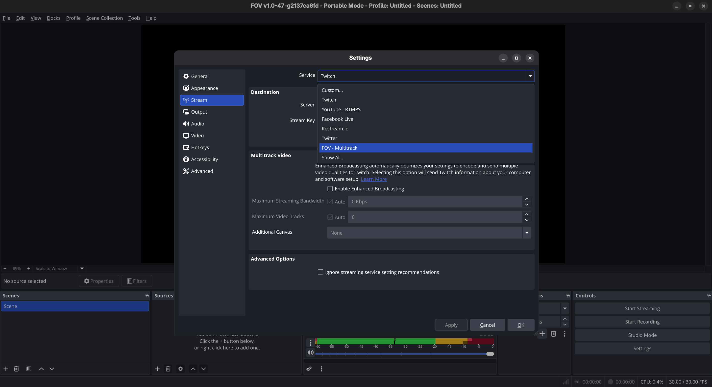
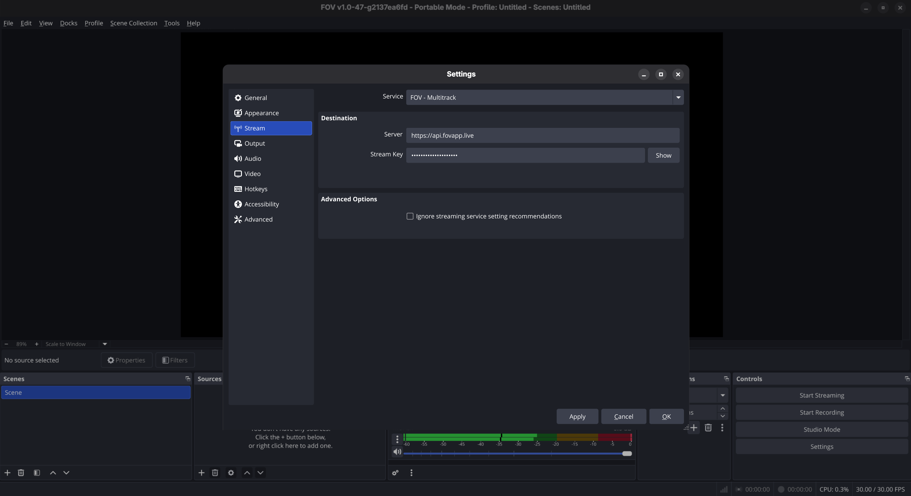
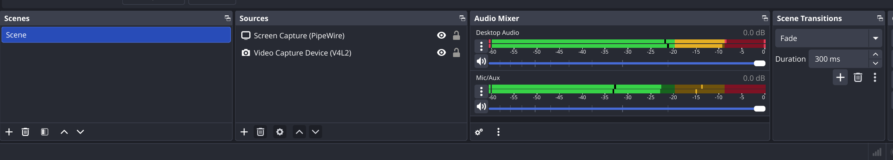
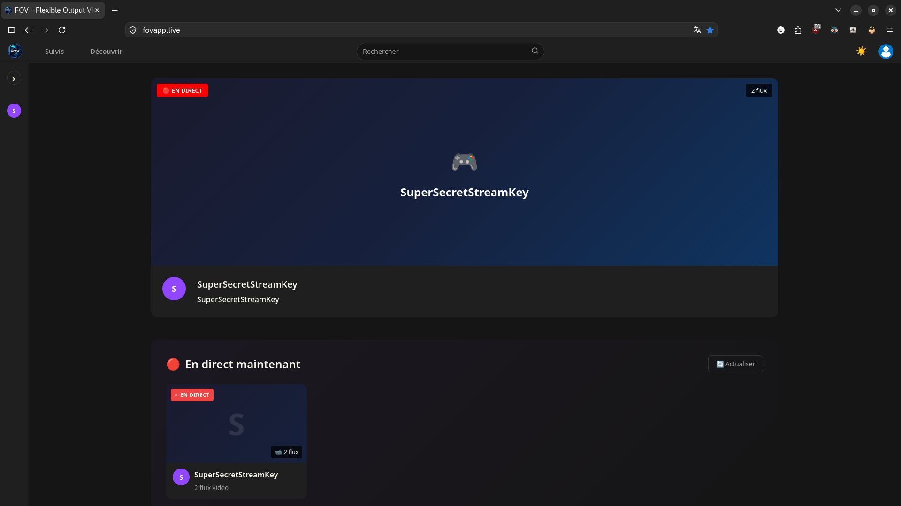
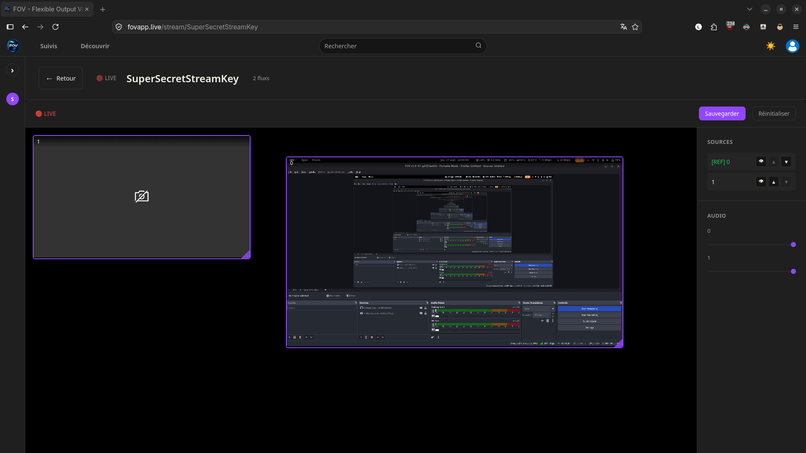

# Start a stream

Welcome! This guide will walk you through setting up and broadcasting your first stream using FOV.

## Prerequisites

Before you begin, ensure you have the FOV software [installed and running](./installation.md).

## Considerations

> [!IMPORTANT]
> Using FOV will require more bandwidth than regular OBS would. This is necessary because each source is sent as a separate video or audio track.

> [!NOTE]
> Your encoder settings will be applied to every video and audio track. This can result in high CPU usage if you are using CPU-based encoders.

## Quickstart

Follow these steps to configure your broadcast:

### 1. Select the service

Open your settings, then select `FOV - Multitrack` from the service dropdown menu in the stream tab.

### 2. Enter the Server URL

Fill in the server field with your FOV web app API URL.

You can use the public server `https://api.fovapp.live` to stream on [https://fovapp.live](https://fovapp.live).

If you are looking to deploy your own instance, please check [the developer documentation](../developer_docs.md).

### 3. Configure your scene

Add multiple audio and video sources to your current scene just like you would in regular OBS.

### 4. Watch the stream

Depending on your settings, your stream will be available on your instance or on [https://fovapp.live](https://fovapp.live).

You can now watch your stream and enjoy the functionalities provided by FOV, such as resizing and moving video tracks around dynamically.

